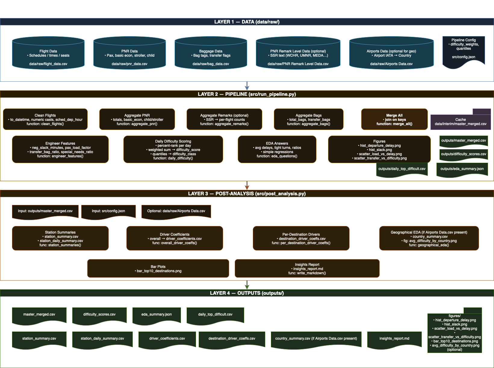

# ✈️ United Airlines SkyHack — Flight Difficulty Score Framework

## 🧭 Overview
This repository contains a data-driven framework to calculate and analyze the **Flight Difficulty Score (FDS)** for United Airlines flights.  
The system integrates multi-source operational data to identify flights with high turnaround complexity and delay risk.

##  Key Features
- Automated EDA answering 5 mandatory questions (delay, ground time, baggage ratio, load correlation, SSRs)
- Daily Flight Difficulty Scoring with ranking (Easy / Medium / Difficult)
- Destination-level insights and operational recommendations
- Optional integration of PNR remarks for special-needs detection

##  System Architecture




##  Outputs
- `difficulty_scores.csv` → Base flight-level scores
- `test_harshmalik.csv` → Final formatted submission file
- `insights_report.md` → Markdown summary of findings
- `/outputs/figures/` → Visual insights for EDA and post-analysis

##  How to Run
```bash
python src/run_pipeline.py --data_dir data/raw --out_dir outputs --cache_dir data/interim
python src/post_analysis.py --merged outputs/master_merged.csv --config src/config.json --out_dir outputs
python src/analyze_results.py
